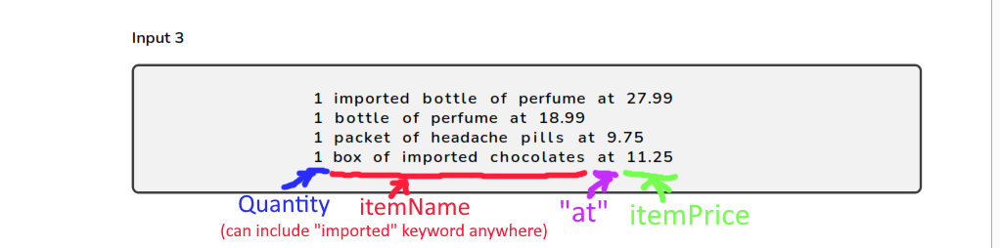
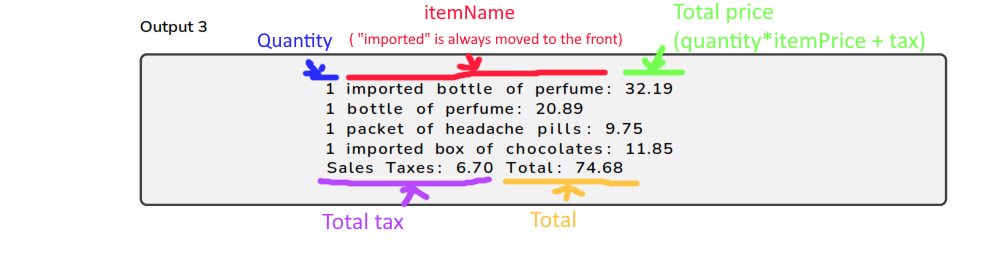

# Sales coding test

I've made this project as part of the coding test (take-home project) for risf.

### Some of the choices I've made

Since the test didn't constraint me with how I should approach this problem, I took some liberties:

* Since I didn't have to develop a Webservice, I figured this is a good opportunity to play around with Spring Shell for
  the first time
* I used spring initialzr for this test, I've added: spring-data-jpa, h2 & Spring shell
* I Store The data in an H2 DB that gets populated on startup. This data is used to determine the category (whether it's
  taxable) & the product itself (known by the market)
* I Use JUnit 5 as a test framework of choice, along with Mockito for mocking. (I had to use AssertJ for 1 case, but I
  added the explanation in the comments)
* I defined 2 types of output, either simple text or a json

### Usage

* Generate the jar with `./mvnw clean install -DskipTests` It's important to skip tests, Spring-shell testing module is
  still in development & can't run the tests in a straight forward way yet
* run the app with `java -jar target/sales-0.0.1-SNAPSHOT.jar`
* Once the shell is displayed, you can start interacting with the console ('help' will display the available commands)
* The command `preview` is used to display the output of the 3 inputs in the pdf.

```
$ preview [INPUT] [OUTPUT_TYPE]
```

* [INPUT] values possible: 1, 2 or 3
* [OUTPUT_TYPE] values possible: 'json' or 'text'
  example:
* preview 3 json

### Thought process

#### Input parsing

The input could be dissected as shown in the picture below. The 3 inputs follow a somewhat defined patter.


* The quantity is the first number in the row (could be multi digit)
* what comes after it until the "at" keyword is the item's name
    * We can use the item name to determine whether we're dealing with an imported item or not (contains "imported" key
      word).
* What comes after "at" represents the price of the item.

#### Output display

There isn't much change for the output other than calculating the totals & moving the "imported" key word to the front
of the item's name:


### Things I would've done in a real scenario

These are some points that I think would've made the code better. But I decided against it as it would be more
complicated for the purpose of this test or would take more time to implement.

* If I was working in a mvc context. I would've added a Custom unchecked exceptions and handled them either in a
  ControllerAdvice or added a response status at the exception declaration class. example:

```
$ @ResponseStatus(HttpStatus.NOT_FOUND)
```

* I would've used BigDecimals instead of doubles for calculating prices & taxes since it's the most precise data
  structure.
* I would've used a better handling of the Import tax value. Maybe by using a state pattern for it depending on the
  country.
* I would've never used a try catch block at the top layer (the Commands layer in this case). I would've delegated that
  to the service layer handle that
* I wouldn't have used `@SneakyThrows` in a real scenario
* I would've definitely looked into making integration tests. I tried to make one for the SalesCommand, but it's quite
  tricky to test spring-shell project, it's test library is still in development

